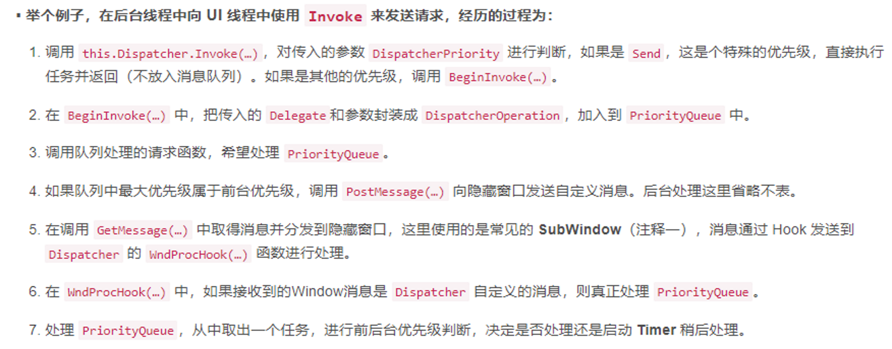
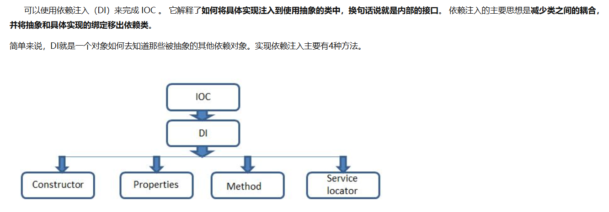
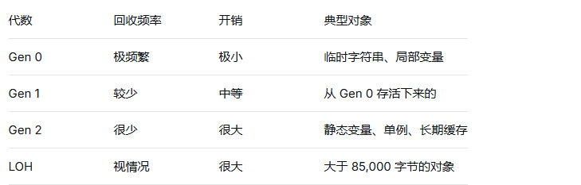
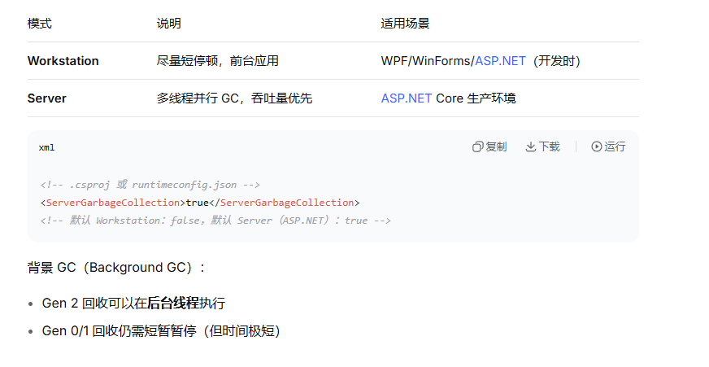
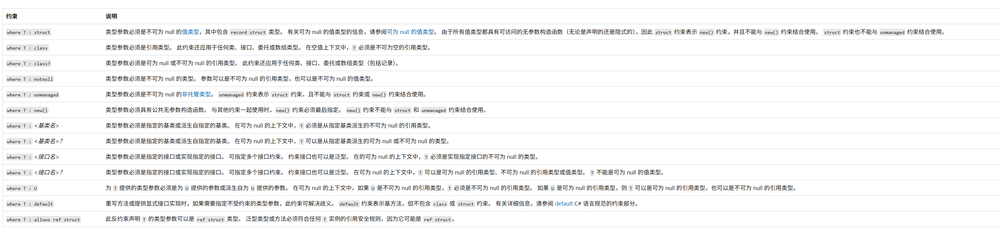

# 一、WPF
## 1. Winform 和 WPF
- GDI+ => DirectX
- 事件驱动 => 数据驱动
- 像素坐标 =》 分辨率无关的矢量布局
- 简单事件 =》 路由事件（冒泡、隧道）
- CLR属性 =》 依赖属性

## 2. WPF 事件

### 1. 事件分类
- Bubbling（冒泡）：冒泡事件是WPF路由事件中最为常见的一种。当事件在源元素（例如，用户点击的按钮）上被触发时，它会沿着元素树（Element Tree）向上传播，直到被处理或到达根元素。
    - 特性：
        - 1. 向上传播：事件从源元素开始，向父元素、祖先元素传播，直到到达根元素或事件被处理。
        - 2. 源元素上方层级对象处理：你可以在源元素的上方层级对象（如父控件或更高层级的控件）上处理冒泡事件。这样，你可以在一个地方集中处理多个子元素的相同事件，减少代码重复。
        - 3. 事件名称：冒泡事件的事件名称通常不带“Preview”前缀。例如，按钮的点击事件是Click，而不是PreviewClick。
- Tunneling（隧道）：隧道事件与冒泡事件相反。它们从根元素开始，向下遍历元素树，直到被处理或到达事件的源元素。
    - 特性：
        - 1. 向下传播：事件从根元素开始，向子元素、源元素传播，直到到达源元素或事件被处理。
        - 2. 上游元素先行处理：由于事件从根元素开始，所以上游元素（如父控件或更高层级的控件）可以在事件到达源元素之前先行截取并进行处理。这种机制允许你在事件传播的早期阶段进行干预或修改事件数据。
        - 3. 事件名称：隧道事件的事件名称通常以“Preview”作为前缀。例如，与按钮点击事件对应的隧道事件是PreviewMouseLeftButtonDown。
- Direct（直接）：仅触发源元素

总结
冒泡事件和隧道事件为WPF中的事件处理提供了灵活性和便利性。冒泡事件允许你在源元素的上方层级对象上处理事件，而隧道事件则允许你在事件传播的早期阶段进行干预或修改事件数据。这两种机制的结合使得开发者能够更加灵活地处理用户界面中的事件。
### 2. 自定义事件
```csharp
// 自定义路由事件
public class MyControl : Control
{
    // 1. 注册路由事件（静态字段）
    public static readonly RoutedEvent TapEvent =
        EventManager.RegisterRoutedEvent(
            "Tap",                          // 事件名称
            RoutingStrategy.Bubbling,       // 路由策略
            typeof(RoutedEventHandler),     // 事件处理委托类型
            typeof(MyControl));             // 所有者类型

    // 2. CLR 事件包装器
    public event RoutedEventHandler Tap
    {
        add => AddHandler(TapEvent, value);
        remove => RemoveHandler(TapEvent, value);
    }

    // 3. 触发事件
    protected virtual void OnTap()
    {
        RoutedEventArgs args = new RoutedEventArgs(TapEvent, this);
        RaiseEvent(args);
    }
}
```
**核心寄存器**：

- EventManager 维护全局路由事件注册表
- 每个 RoutedEvent 静态字段是全局唯一标识符
- 控件通过 AddHandler / RemoveHandler 订阅事件
### 3. RoutedEventArgs 关键成员
```csharp
public class RoutedEventArgs : EventArgs
{
    public object Source { get; }           // 事件的原始源（谁触发的）
    public object OriginalSource { get; }   // 可视化树中的最底层源
    public RoutedEvent RoutedEvent { get; } // 事件标识符
    public bool Handled { get; set; }       // 标记已处理（阻止继续传播）
}
```
Handled 阻止传播
```csharp
// 隧道阶段拦截：阻止按键进入 TextBox
txt.PreviewKeyDown += (s, e) =>
{
    if (e.Key == Key.A)
    {
        e.Handled = true;  // 拦截 A 键，不再传到下一阶段
        Console.WriteLine("A 键被拦截");
    }
};
```

###  4. 附加事件
**附加事件允许控件订阅子元素的事件：**
```xml
<!-- Button.Click 是冒泡事件，在 Window 上订阅也能收到 -->
<Window Button.Click="Window_Click">
    <Grid>
        <Button Content="点我"/>
    </Grid>
</Window>
```
```csharp
// C# 中订阅附加事件
grid.AddHandler(Button.ClickEvent, new RoutedEventHandler(Grid_Click));

// 自定义附加事件
public static readonly RoutedEvent MouseLeftButtonDownEvent =
    EventManager.RegisterRoutedEvent(
        "MouseLeftButtonDown",
        RoutingStrategy.Bubbling,
        typeof(MouseButtonEventHandler),
        typeof(UIElement));
```
### 5. 若事件模式
问题： 长生命周期对象订阅短生命周期对象的事件会导致内存泄漏。
```csharp
// ❌ 潜在的内存泄漏
public class LongLivingService
{
    public LongLivingService(Button button)
    {
        button.Click += OnClick;  // button 存活时，LongLivingService 不会被回收
    }
}

// ✅ 弱事件模式
public class WeakEventSubscriber : IWeakEventListener
{
    public WeakEventSubscriber(Button button)
    {
        // 订阅弱事件
        WeakEventManager<Button, RoutedEventArgs>.AddHandler(
            button, "Click", OnClick);
    }

    public bool ReceiveWeakEvent(Type managerType, object sender, EventArgs e)
    {
        if (managerType == typeof(WeakEventManager<Button, RoutedEventArgs>))
        {
            OnClick(sender, (RoutedEventArgs)e);
            return true;
        }
        return false;
    }
}
```
### 6. 事件系统运作流程
1. 底层输入（鼠标、键盘）
   ↓
2. WPF 输入管理器接收到消息
   ↓
3. 转换为 WPF 事件（MouseDown、KeyDown）
   ↓
4. 开始路由传播：
   ├── Tunneling 阶段（Preview 事件，从根到源）
   ├── 源元素触发
   └── Bubbling 阶段（普通事件，从源到根）
   ↓
5. e.Handled = true 可以中断传播

**WPF 事件系统 = 路由事件 + 隧道/冒泡策略 + 可视化树传播 + Handled 拦截 + 弱事件保护。它不是简单的 .NET 委托，而是一套完整的事件传播基础设施。**
## 3. WPF 属性系统
- 常规属性：存自己的值，简单轻量，给数据模型用
- 依赖属性：存在全局系统，支持绑定/动画/样式，给控件用
- 附加属性：依赖属性的变种，定义在 A 类，附加到 B 对象上，用来扩展功能

WPF 属性系统是什么：

- 一套全局的属性值存储和计算基础设施
-  让属性值可以从多个来源按优先级动态决定
- 提供变化通知、值继承、类型转换等能力

如何运作：

- 每个 DependencyObject 有有效值表，只存被修改过的属性
- GetValue 按 12 级优先级查找第一个有效值
- SetValue 触发校验、强制、回调、重新布局/渲染
- 属性继承自动沿可视化树向下传递

CLR 包装器只是对属性系统的薄封装
### 1. 常规属性
特点：
- 值直接存储在类的私有字段里
- 没有额外功能——不能绑定、不能动画、不能样式化
- 内存占用小，速度快
- 适合数据模型（Model/ViewModel 里的 POCO 类）
```csharp
public class Person
{
    private string _name;
    public string Name
    {
        get => _name;
        set => _name = value;
    }
}
// 或者：public string Name { get; set; }
```
### 2. 依赖属性
**依赖属性不把值存在对象自己的字段里，而是存在 WPF 全局的属性系统中。**
**它的值依赖于多种来源的优先级计算，不是简单的一个字段值。**

优先级（由低到高）：
  1. 属性系统默认值          → new PropertyMetadata(0.0) 里的值
  2. 依赖属性继承值          → DataContext 从父元素向下传递
  3. 主题样式默认值          → 系统主题（如 Aero、Luna）
  4. 主题样式触发器          → 主题里的 Trigger
  5. 隐式样式 Setter         → **Style TargetType="Button"** 不加 x:Key
  6. 样式 Trigger            → **Trigger Property="IsMouseOver" Value="True"**
  7. 模板触发器              → **ControlTemplate 里的 Trigger**
  8. 显式样式 Setter         → **Style x:Key="MyStyle"** 或用 **Style="{StaticResource MyStyle}"**
  9. 本地值                  → 直接在 XAML 或代码里设置的值
 10. 持有动画               → HoldEnd 行为的动画
 11. 活动动画               → 正在播放的动画
 12. 强制回调               → CoerceValueCallback（优先级最高，可以修正任何值）

```csharp
public class MyControl : UserControl
{
    // 1. 注册依赖属性（静态字段）
    public static readonly DependencyProperty ValueProperty =
        DependencyProperty.Register(
            "Value",                    // 属性名
            typeof(double),            // 属性类型
            typeof(MyControl),         // 所有者类型
            new PropertyMetadata(0.0, OnValueChanged, CoerceValue));

    // 2. CLR 包装器（只是调用 GetValue/SetValue）
    public double Value
    {
        get => (double)GetValue(ValueProperty);
        set => SetValue(ValueProperty, value);
    }

    // 3. 属性变化回调
    private static void OnValueChanged(DependencyObject d, DependencyPropertyChangedEventArgs e)
    {
        var control = (MyControl)d;
        Console.WriteLine($"值从 {e.OldValue} 变为 {e.NewValue}");
    }

    // 4. 强制值回调（修正非法值）
    private static object CoerceValue(DependencyObject d, object baseValue)
    {
        double val = (double)baseValue;
        return val < 0 ? 0 : val > 100 ? 100 : val;  // 限制在 0-100
    }
}
```
### 3. 附加属性
**附加属性是一种定义在另一个类中，但可以被任何 DependencyObject 使用的依赖属性。**

附加属性的本质
- 附加属性就是一个依赖属性，只不过：
    - Register → RegisterAttached
    - 包装器用静态方法 GetXxx / SetXxx（不用 CLR 属性）
    - 可以附加到任何 DependencyObject 上

```csharp
public class Grid
{
    // 注册附加属性（用 RegisterAttached）
    public static readonly DependencyProperty RowProperty =
        DependencyProperty.RegisterAttached(
            "Row",
            typeof(int),
            typeof(Grid),
            new PropertyMetadata(0));

    // Get/Set 方法（不是 CLR 包装器）
    public static int GetRow(UIElement element)
    {
        return (int)element.GetValue(RowProperty);
    }

    public static void SetRow(UIElement element, int value)
    {
        element.SetValue(RowProperty, value);
    }
}
```

## 4. WPF 逻辑树与可视化树
- 逻辑树：在 XAML 中声明的结构，是 UI 元素的"逻辑父子关系"。
    - 特点：
        - 只包含显式添加的元素（没有内部零件）
        - 严格反映 XAML 的嵌套结构
        - 用来确定父子关系、资源查找、属性继承
- 可视化树：实际渲染时的完整控件结构，包含控件的内部视觉组件
    - 特点
        - 包含所有控件的内部模板元素（ButtonChrome、ContentPresenter 等）
        - 是实际被渲染的树，决定视觉效果
        - 路由事件沿可视化树传播
        - 可以通过 ControlTemplate 完全改变可视化树结构
## 5. 窗体加载执行顺序
- 1. Window.Initialized：在窗体对象被初始化后触发。
- 2. Window.Activated：窗体成为活动窗体并获得焦点时触发。
- 3. Window.Loaded：窗体的内容已经加载完成并准备好显示时触发。
- 4. Window.ContentRendered：窗体的内容已经呈现完成时触发。在此事件之后，窗体已经完全显示在屏幕上。
- 5. Window.Deactivated：窗体由活动状态变为非活动状态，并失去焦点时触发。
- 6. Window.Closing：窗体即将关闭时触发。可以取消窗体的关闭操作。
- 7. Window.Closed：窗体已经完全关闭时触发。
- 8. Window.Unloaded：窗体的内容已经从UI树中移除时触发。
## 6. 静态、动态资源
StaticResource = 加载时查一次，永不追踪（快，但不灵活）
DynamicResource = 每次都要查，追踪变化（慢一点，但自动更新）
默认用 StaticResource，只有在需要运行时变化时才用 DynamicResource。系统资源始终用 DynamicResource。
## 7. WPF 中Template
- ControlTemplate 让你完全重新定义控件的视觉结构，但保留原有行为。
- DataTemplate 决定数据对象在 UI 上的样子。
- 决定 ItemsControl 中项容器用什么样的布局。
## 8. MVVM
## 9. Dispatcher

## 10. 自定义控件步骤
## 11. Binding 
- OneWay：数据从源到目标单向流动，目标不会影响源。
- TwoWay：数据在源和目标之间双向流动，任何一方的更改都会反映到另一方。
- OneTime：数据在绑定时只从源到目标传递一次，之后不再更新。
- OneWayToSource：数据从目标到源单向流动，适用于需要从 UI 更新数据源的场景。
# 二、C#
## 1. CLR
### 执行步骤
托管执行过程包括以下步骤：

- 选择编译器。 若要获取公共语言运行时提供的优势，必须使用面向运行时的一个或多个语言编译器。
- 将代码编译为中间语言。 编译源代码会转换为公共中间语言（CIL），并生成所需的元数据。
- 将 CIL 编译为本机代码。 在执行时，实时 （JIT） 编译器将 CIL 转换为本机代码。 在此编译过程中，代码必须通过验证过程来检查 CIL 和元数据，以确定代码是否可以确定为类型安全。
- 运行代码。 公共语言运行时提供基础结构，使执行能够进行，以及在执行期间可以使用的服务。

CLR = 托管代码的执行环境，提供内存管理、线程管理、异常处理、安全检查等核心服务。

没有 CLR，C# 的 IL 代码就是一堆无法直接执行的字节码。

核心三组件：
- JIT 编译器：把 IL 实时编译成本机 CPU 指令
- 垃圾回收器 (GC)：自动内存管理
- 类型加载器：加载程序集、解析元数据、安全检查

## 2. C# 虚方法(virtual) 和 抽象方法(abstract)的区别
- virtual 关键字：它用于定义一个虚方法（VirtualMethod）。虚方法是一种允许派生类重写该方法的方法。当在子类中使用 override 关键字重写父类的虚方法时，父类的虚方法将被覆盖。如果子类没有重写虚方法，则调用父类的虚方法。可以通过 new 关键字隐藏基类的虚方法，但这不会实现多态性。
- abstract 关键字：它用于定义抽象类（Abstract Class）或抽象方法（AbstractMethod）。抽象类是不能被实例化的类，抽象方法是只有声明而没有具体实现的方法。必须在派生类中使用 override关键字来实现抽象方法。抽象类和抽象方法通常用于定义接口和规范，以确保继承类实现了必要的行为。抽象类中可以包含非抽象的成员，而抽象方法必须在抽象类中定义。
## 3. 事件和委托
- 委托是一种引用类型，表示对具有特定参数列表和返回类型的方法的引用。
在实例化委托时，你可以将其实例与任何具有兼容签名和返回类型的方法相关联。 你可以通过委托实例调用方法，委托用于将方法作为参数传递给其他方法。 
事件处理程序就是通过委托调用的方法。
- 事件是基于委托的，为委托提供一个订阅或发布的机制。事件是一种特殊的委托，调用事件和委托是一样的，事件可以被看作是委托类型的一个变量，通过事件注册、取消多个委托和方法。
```C#
    public delegate void EventHandler(object? sender, EventArgs e);
    public event EventHandler StateChanged;
```
## 4. Action、Func
- Action：Action是一个没有返回值的委托类型。它可以接受最多16个参数，用于表示不需要返回结果的操作或方法。
示例：Action<int, string> 表示一个接受一个整数和一个字符串参数的委托，没有返回值。
- Func：Func是一个有返回值的委托类型。它的最后一个参数表示返回值类型，其余参数为输入参数。Func 可以接受最多16个输入参数。 
示例：Func<int, int, string> 表示一个接受两个整数参数并返回一个字符串结果的委托。

Action主要用于表示没有返回值的委托，而 Func 用于表示有返回值的委托。
## 5. 多个订阅事件触发顺序
多播委托就是按 += 的顺序形成一个调用链表，触发时从头到尾依次执行
## 6. 前台线程/后台线程

- 前台线程：会阻止进程退出，必须等线程执行完毕。
- 后台线程：不会阻止进程退出，进程结束时会被强制终止。

在C#中，可以通过设置线程的IsBackground属性来指定线程是前台线程还是后台线程。默认情况下，新创建的线程是前台线程（IsBackground属性为false）。
## 7. 线程创建的几种方式
- Thread
```C#
var thread = new Thread(() =>
{
    Console.WriteLine($"线程ID: {Environment.CurrentManagedThreadId}");
});
thread.Start();

// 带参数
var thread2 = new Thread(obj =>
{
    Console.WriteLine($"参数: {obj}");
});
thread2.Start("Hello");

// 设置前后台
thread.IsBackground = true;  // 后台线程，主线程退出时自动终止
```
- ThreadPool 线程池
    - 线程复用，避免频繁创建销毁开销，适合短任务
```C#
ThreadPool.QueueUserWorkItem(state =>
{
    Console.WriteLine($"线程池线程: {state}");
}, "参数");
```
- Task
```C#
// 无返回值
Task.Run(() =>
{
    Console.WriteLine("Task 运行中");
});

// 有返回值
Task<int> task = Task.Run(() =>
{
    return 42;
});
int result = task.Result;   // 阻塞等待
int result2 = await task;   // 异步等待

// 冷启动（需要手动启动）
var cold = new Task(() => Console.WriteLine("冷任务"));
cold.Start();
```
- async/await
 - 本质上还是在线程上执行，但由状态机管理，不直接操作线程
```C#
async Task DoWorkAsync()
{
    await Task.Delay(1000);           // 不阻塞线程
    var data = await FetchDataAsync();
    Console.WriteLine(data);
}
```
- Parallel 并行循环
    - 底层使用线程池，自动分配多个线程并行处理
```C#
Parallel.For(0, 10, i =>
{
    Console.WriteLine($"并行处理: {i}");
});

Parallel.ForEach(items, item =>
{
    ProcessItem(item);
});
```
- BackgroundWorker
    -  WinForms/WPF 时代常用，自动处理跨线程 UI 更新，现在已被 async/await 替代。
```C#
var worker = new BackgroundWorker();
worker.DoWork += (s, e) =>
{
    // 后台工作
    e.Result = ComputeResult();
};
worker.RunWorkerCompleted += (s, e) =>
{
    // UI 线程回调
    label1.Text = e.Result.ToString();
};
worker.RunWorkerAsync();
```

## 8. Task 如何取消
```C#
// 1. 创建令牌源
var cts = new CancellationTokenSource();

// 2. 获取令牌，传给任务
CancellationToken token = cts.Token;

// 3. 发取消信号
cts.Cancel();  // 或 cts.CancelAfter(3000);  // 3 秒后自动取消
```
## 9. 线程同步有哪些方式
### 锁机制
    - Lock(最常用)
        - 原理： Monitor.Enter/Exit 的语法糖，同一时刻只允许一个线程进入。
    ```C#
    private readonly object _lockObj = new();
    private int _counter;

    lock (_lockObj)
    {
        _counter++;
    }
    ```
    - Monitor（lock 的底层）
    ```C#
    Monitor.Enter(_lockObj);
    try
    {
        _counter++;
    }
    finally
    {
        Monitor.Exit(_lockObj);
    }

    // 带超时的尝试获取
    if (Monitor.TryEnter(_lockObj, 1000))
    {
        try { /* 临界区 */ }
        finally { Monitor.Exit(_lockObj); }
    }
    ```
    - Mutex（跨进程锁）
        - 特点： 比 lock 慢 50 倍左右，能跨进程，有名称。
    ```C#
    using var mutex = new Mutex(false, "Global\\MyAppMutex");

    if (mutex.WaitOne(TimeSpan.FromSeconds(3)))
    {
        try
        {
            // 跨进程互斥，常用于单实例应用
        }
        finally
        {
            mutex.ReleaseMutex();
        }
    }
    ```
    - SpinLock（极短临界区专用）
        -  特点： 不阻塞线程，原地空转等待，适合保护极短操作。千万不能在里面做 I/O 或调用未知代码。
    ```C#
    var spinLock = new SpinLock();
    bool lockTaken = false;

    try
    {
        spinLock.Enter(ref lockTaken);
        _counter++;  // 临界区极短（几纳秒级别）
    }
    finally
    {
        if (lockTaken) spinLock.Exit();
    }
    ```
    - SemaphoreSlim / Semaphore（信号量）
        - 经典场景： 限制并发数（比如同时最多 5 个 HTTP 请求）。
    ```C#
    // 轻量版（进程内）
    var semaphore = new SemaphoreSlim(3);  // 最多 3 个并发

    await semaphore.WaitAsync();
    try
    {
        // 访问受限制的资源
    }
    finally
    {
        semaphore.Release();
    }

    // 重量版（可跨进程）
    var sem = new Semaphore(0, 3, "MySemaphore");
    ```
    - ReaderWriterLockSlim（读写锁）
        - 场景： 读多写少，提升并发性能。
    ```C#
    var rwLock = new ReaderWriterLockSlim();

    // 读（可并发）
    rwLock.EnterReadLock();
    try { /* 读取共享数据 */ }
    finally { rwLock.ExitReadLock(); }

    // 写（互斥，所有读都等着）
    rwLock.EnterWriteLock();
    try { /* 修改共享数据 */ }
    finally { rwLock.ExitWriteLock(); }
    ```
### 信号机制
    - AutoResetEvent / ManualResetEvent
    ```C#
    // AutoResetEvent：自动关门
    var auto = new AutoResetEvent(false);

    // 线程 A 等待
    Task.Run(() =>
    {
        auto.WaitOne();  // 阻塞直到收到信号
        Console.WriteLine("收到信号");
    });

    auto.Set();  // 线程 B 发信号，A 醒来，门自动关上

    // ManualResetEvent：手动关门
    var manual = new ManualResetEvent(false);
    manual.Set();    // 开门
    manual.Reset();  // 关门
    ```
    - Barrier（集体同步）
    ```C#
    var barrier = new Barrier(3, b =>
    {
        Console.WriteLine($"第 {b.CurrentPhaseNumber} 阶段完成");
    });

    // 3 个线程各自干活，然后等待其他人
    Task.Run(() => { DoWork(); barrier.SignalAndWait(); });
    Task.Run(() => { DoWork(); barrier.SignalAndWait(); });
    Task.Run(() => { DoWork(); barrier.SignalAndWait(); });
    ```
    - CountdownEvent（倒计数）
    ```C#
    var countdown = new CountdownEvent(3);

    // 3 个线程干完活各自 Signal
    Task.Run(() => { DoWork(); countdown.Signal(); });
    Task.Run(() => { DoWork(); countdown.Signal(); });
    Task.Run(() => { DoWork(); countdown.Signal(); });

    countdown.Wait();  // 主线程等待 3 个都完成
    Console.WriteLine("全部完成");
    ```
### 无锁/轻量机制
    - Interlocked（原子操作）
```csharp
int counter = 0;
Interlocked.Increment(ref counter);   // 原子自增
Interlocked.Exchange(ref counter, 0);  // 原子赋值
Interlocked.CompareExchange(ref counter, newVal, expected); // CAS
```
- volatile（易失字段）
```csharp
private volatile bool _shouldStop;

// 线程 A
_shouldStop = true;

// 线程 B
while (!_shouldStop)  // 每次从内存读，不用缓存
{
    // ...
}
```
## 10. IOC/DI
- IOC，意为控制反转，英文（Inversion of Control），它不是一种技术，而是一种设计思想，用于解耦组件之间的依赖关系。它的核心思想是将程序的控制权从程序内部转移到外部，由外部容器负责创建和管理对象之间的依赖关系，从而实现了解耦和灵活性。
- DI，意为依赖注入，英文（Dependency Injection）。组件之间的依赖关系由容器在运行期间决定，即由容器动态地将依赖项注入到组件当中，通过依赖注入机制，我们有时候只需要简单地配置，无需修改代码即可完成自身逻辑，而不必去关心依赖的具体资源，姓甚名谁，由何处来，又去往何处。

## 11. GC
### 1. 基本概念
托管堆 vs 非托管资源

```csharp
// 托管资源：GC 自动回收
string s = new string('x', 1000);     // 不用管，GC 会处理
List<int> list = new List<int>();     // 同上

// 非托管资源：必须手动释放
FileStream fs = new FileStream(...);  // 文件句柄
SqlConnection conn = new SqlConnection(); // 数据库连接
IntPtr ptr = Marshal.AllocHGlobal(100);   // 非托管内存
```
### GC代数（Generations）
GC 假设：对象越新，死得越快；越老，活得越久。
┌─────────────────────────────────────┐
│  Gen 0  │  Gen 1  │    Gen 2        │
│  年轻代  │  中年代  │    老年代       │
│  (256KB) │  (2MB)  │   (尽可能大)    │
└─────────────────────────────────────┘
     ↑ 新对象分配在这里



```csharp
// 演示代数提升
var obj = new byte[1000];  // Gen 0

// 一次 Gen 0 回收后存活 → 提升到 Gen 1
// 又一次 Gen 1 回收后存活 → 提升到 Gen 2
```
### 3 大对象堆（LOH）
≥ 85,000 字节（约 83KB）的对象直接进 LOH。

```csharp
byte[] small = new byte[10_000];   // Gen 0，普通堆
byte[] large = new byte[100_000];  // LOH，大对象堆
```
LOH 的特殊之处：
- 不会移动（不压缩，默认情况下），容易产生碎片
- .NET 4.5.1+ 可手动压缩：GCSettings.LargeObjectHeapCompactionMode
- 回收时直接算 Gen 2 级别的回收
### 4. GC工作模式

### 5. 终结器（Finalizer）与 IDisposable
```csharp
public class MyResource : IDisposable
{
    private bool _disposed = false;
    private IntPtr _handle;  // 非托管资源

    // 用户主动调用
    public void Dispose()
    {
        Dispose(true);
        GC.SuppressFinalize(this);  // 告诉 GC：别调终结器了，我已经清完了
    }

    // 保护的释放逻辑
    protected virtual void Dispose(bool disposing)
    {
        if (_disposed) return;

        if (disposing)
        {
            // 释放托管资源（其他 IDisposable 对象）
            _managedResource?.Dispose();
        }

        // 释放非托管资源（无论 disposing 是 true/false 都要做）
        if (_handle != IntPtr.Zero)
        {
            Marshal.FreeHGlobal(_handle);
            _handle = IntPtr.Zero;
        }

        _disposed = true;
    }

    // 终结器：GC 回收时兜底
    ~MyResource()
    {
        Dispose(false);
    }
}

// 使用
using (var resource = new MyResource())
{
    // 离开 using 自动调 Dispose()
}
```
关键：终结器会让对象多活一轮 GC——先放到终结队列，下一次 GC 才真正回收。

### 6. 手动触发和调优
```csharp
// 强制 GC（一般别用，仅用于测试/特殊场景）
GC.Collect();           // 回收所有代
GC.Collect(0);          // 只回收 Gen 0
GC.Collect(2, GCCollectionMode.Forced);  // 回收 Gen 0~2

// 等待终结器执行完毕
GC.WaitForPendingFinalizers();

// 获取内存信息
long totalMemory = GC.GetTotalMemory(false);

// 大对象堆压缩（.NET 4.5.1+）
GCSettings.LargeObjectHeapCompactionMode = 
    GCLargeObjectHeapCompactionMode.CompactOnce;
GC.Collect();
```
## 12. 泛型、泛型约束
- 泛型：允许编写适用于任何类型的代码，同时保持完整类型安全性。 与其为int、string及其他每种所需类型编写单独的类或方法，不如通过使用一个或多个类型参数（例如T，或者TKey和TValue）来编写一个版本，并在使用时指定实际类型。 编译器在编译时检查类型，因此不需要运行时强制转换或风险 InvalidCastException。
- 泛型约束

## 13. P/Invoke
- P/Invoke 是可用于从托管代码访问非托管库中的结构、回调和函数的一种技术。。
### 1. 基本概念

核心三要素：
- DllImport 特性 — 指定 DLL 名称和入口点
- 方法签名 — 声明对应 C 函数的 C# 签名
- 类型封送（Marshaling）— CLR 自动转换数据类型

注意：int* 返回值不可以直接使用string 承接