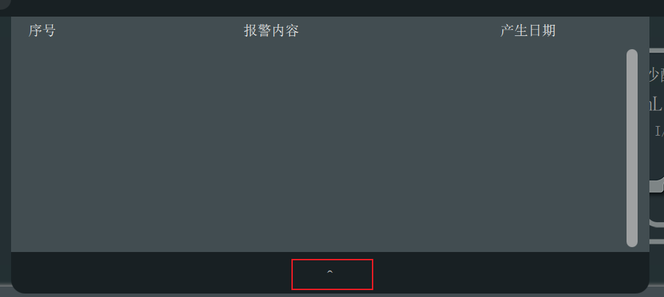
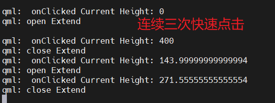
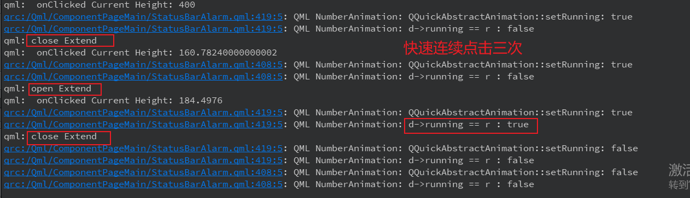

# 一、背景描述

1. 介绍 
程序中有报警界面，点击标题栏后，numberAnimation 缓慢展开报警界面，完全展开后，最下方有一个'^'按钮，点击可缓慢关闭报警界面

2. 现象
**连续三次快速点击展开按钮，最下方'^'按钮消失，报警界面展开**

3. 代码
QML
```xml
    //属性动画
    NumberAnimation{
        id: alarm_start_anim
        target: alarm_content_item
        properties: "height"
        from: 0
        to: alarm_bar_extend_height
        //动画持续时间，毫秒
        duration: 500
        //动画渐变曲线
        easing.type: Easing.OutQuad
    }

    NumberAnimation{
        id: alarm_stop_anim
        target: alarm_content_item
        properties: "height"
        from: alarm_bar_extend_height
        to: 0
        duration: 500;
        easing.type: Easing.OutQuad
    }

    function openExtend()
    {
        if(is_at_main_page === true)
        {
            slide_drawer_status =true
            alarm_start_anim.start()
            alarm_content.visible =true
            //console.log("open Extend")
        }
    }

    function closeExtend()
    {
        if(slide_drawer_status == true)
        {
            slide_drawer_status =false
            alarm_content.visible =false
            alarm_stop_anim.start()
        }
    }

```

# 二、追溯
1. 复现步骤
连续三次快速点击弹窗弹出按钮可复现现象

2. 代码修复
将start调用改为restart，避免快速点击时前一个动画未关闭

```xml
    function openExtend()
    {
        if(is_at_main_page === true)
        {
            slide_drawer_status =true
            alarm_stop_anim.stop()
            alarm_content.visible =true
            alarm_start_anim.restart()
            //alarm_start_anim.start()
            //console.log("open Extend")
        }
    }

    function closeExtend()
    {
       if(slide_drawer_status != true)
          return

         slide_drawer_status = false
         alarm_start_anim.stop()
         alarm_content.visible = false
         alarm_stop_anim.restart()
        //console.log("close Extend")
    }

```
# 三、NumberAnimation 源码分析

qmltype： NumberAnimation
instantiates： QQuickNumberAnimation

NumberAnimation 继承关系：
- QQuickNumberAnimation : public QQuickPropertyAnimation
- QQuickPropertyAnimation : public QQuickAbstractAnimation


```C++
void QQuickAbstractAnimation::restart()
{
    stop();
    start();
}
void QQuickAbstractAnimation::start()
{
    setRunning(true);
}

void QQuickAbstractAnimation::setRunning(bool r)
{
    Q_D(QQuickAbstractAnimation);
    if (!d->componentComplete) {
        d->running = r;
        if (r == false)
            d->avoidPropertyValueSourceStart = true;
        else if (!d->registered) {
            d->registered = true;
            QQmlEnginePrivate *engPriv = QQmlEnginePrivate::get(qmlEngine(this));
            static int finalizedIdx = -1;
            if (finalizedIdx < 0)
                finalizedIdx = metaObject()->indexOfSlot("componentFinalized()");
            engPriv->registerFinalizeCallback(this, finalizedIdx);
        }
        return;
    }
    // 多次点击，上一次动画未关闭，此次动画会不执行
    if (d->running == r)
        return;

    if (d->group || d->disableUserControl) {
        qmlWarning(this) << "setRunning() cannot be used on non-root animation nodes.";
        return;
    }

    d->running = r;
    if (d->running) {
        bool supressStart = false;
        if (d->alwaysRunToEnd && d->loopCount != 1
            && d->animationInstance && d->animationInstance->isRunning()) {
            //we've restarted before the final loop finished; restore proper loop count
            if (d->loopCount == -1)
                d->animationInstance->setLoopCount(d->loopCount);
            else
                d->animationInstance->setLoopCount(d->animationInstance->currentLoop() + d->loopCount);
            supressStart = true;    //we want the animation to continue, rather than restart
        }
        if (!supressStart)
            d->commence();
    } else {
        if (d->paused) {
            d->paused = false; //reset paused state to false when stopped
            emit pausedChanged(d->paused);
        }

        if (d->animationInstance) {
            if (d->alwaysRunToEnd) {
                if (d->loopCount != 1)
                    d->animationInstance->setLoopCount(d->animationInstance->currentLoop()+1);    //finish the current loop
            } else {
                d->animationInstance->stop();
                emit stopped();
            }
        }
    }


    if (r == d->running) {
        // This might happen if we start an animation with 0 duration: This will result in that
        // commence() will emit started(), and then when it starts it will call setCurrentTime(0),
        // (which is both start and end time of the animation), so it will also end up calling
        // setRunning(false) (recursively) and stop the animation.
        // Therefore, the state of d->running will in that case be different than r if we are back in
        // the root stack frame of the recursive calls to setRunning()
        emit runningChanged(d->running);
    }
}
```

可以看到源码中restart（）函数会先调用stop（）函数再开始动画，如果直接start（），在setRunning（）中会判断动画运行状态，如果动画还在运行则此次动画不执行

添加日志确认


结论：根据日志看到第二次close 弹窗时，由于上一次动画未结束，所以这次动画直接return，现象上看就是弹窗未收回，而"^"确消失了，建议使用restart（）函数，而不是直接使用start（）