参考：

Yocto 官网：<https://docs.yoctoproject.org/>

Yocto Release: <https://www.yoctoproject.org/development/releases/#current>

# 一、Yocto

## 1. Yocto 基础信息

### 1.1 Yocto 概述

Yocto全称是Yocto Project（官方简称YP） 是Linux基金会在2010年推出的一个开源的**协作项目**。提供模板、工具和方法以创建定制的Linux系统和配套工具，而无需关心**硬件体系**。主要由Poky和 其他一些工具组成。

从历史上看，**Yocto Project是从OpenEmbedded项目**发展而来的。他们本是两个不同的项目（左侧分离视图），然而，目前的**OpenEmbedded与Yocto Project**已经融合为一体了（右侧合并视图），因为目前已经很少见单独使用OpenEmbedded了。

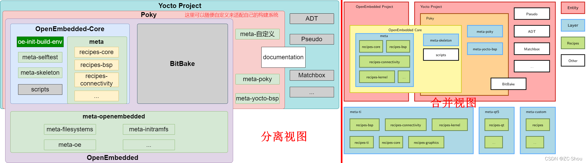

### 1.2 Yocto 组件

#### 1.2.1 Open-Embedded Build System 组件

1. 组件：

   -  **Metadata**: 用于构建 Linux 发行版，并包含在 OpenEmbedded 构建系统在构建镜像
   时解析的文件中
      - **.bb（BitBake Recipe）文件**：描述如何获取、配置、编译和安装一个软件包
      - **.bbappend 文件**：用于扩展或修改已有的 .bb 文件
      - **.conf 配置文件**：配置文件定义了控制 OpenEmbedded 构建过程的各种配置变量。这些文件分为几个部分，分别定义了**机器配置选项、发行版配置选项、编译器调优选项、通用配置选项和用户配置选项**， conf/local.conf这些选项位于构建目录中。
      - **.bbclass 类文件**：类文件用于抽象通用功能，并在多个配方（.bb）文件之间共享
      - **.inc 包含文件（Include File）**：将通用配置和函数提取到单独的文件中，可以被多个recipe(.bb) 文件或其他 .inc 文件包含使用
   - **BitBake**： BitBake 是 Yocto 项目的核心组件，OpenEmbedded 构建系统使用它来构建镜像。虽然 BitBake 对构建系统至关重要，但它的维护独立于 Yocto 项目。

       BitBake 是一个通用的任务执行引擎，它允许在复杂的任务间依赖关系约束下高效并行地运行 shell 和 Python 任务。简而言之，BitBake 是一个**构建引擎**，它通过处理以特定格式编写的配方来执行一系列任务。

   - **OpenEmbedded-Core**： OpenEmbedded-Core (OE-Core) 是一个通用的元数据层（例如配方、类和相关文件），供包括 Yocto 项目在内的 OpenEmbedded 衍生系统使用。Yocto 项目和 OpenEmbedded 项目共同维护 OpenEmbedded-Core。

       从历史上看，Yocto 项目一直将 OE-Core 元数据集成到 Yocto 项目源代码库参考系统 (Poky) 中。在 Yocto 项目 1.0 版本之后，Yocto 项目和 OpenEmbedded 达成合作协议，共同共享一套通用的核心元数据 (OE-Core)，其中包含了之前 Poky 中的许多功能。
   - **Layer (meta-xxx)**: 层是包含相关元数据（即指令集）的存储库，这些元数据告诉 OpenEmbedded 构建系统如何构建目标。

#### 1.2.2 参考发行版 (Poky)

**Poky**是一个参考嵌入式发行版和参考测试配置实例，其创建目的在于：
- 提供一个基础功能发行版，可用于演示如何定制发行版；
- 测试 Yocto 项目组件，Poky 用于验证 Yocto 项目；
- 作为用户下载 Yocto 项目的途径。Poky 并非产品级发行版，而是定制的良好起点。

文件夹说明：   
- **BitBake** 是一个任务执行器和调度器，它是 OpenEmbedded 构建系统的核心。
- **meta-poky**这是 Poky 特有的元数据。
- **meta-yocto-bsp**它们是 Yocto 项目特定的板级支持包 (BSP)。
- **OpenEmbedded-Core (OE-Core)** 元数据包含共享配置、全局变量定义、共享类、打包方式和配方。类定义了构建逻辑的封装和继承。配方是待构建软件和镜像的逻辑单元。
- **documentation** 包含用于创建用户手册集的 Yocto 项目源文件。
  
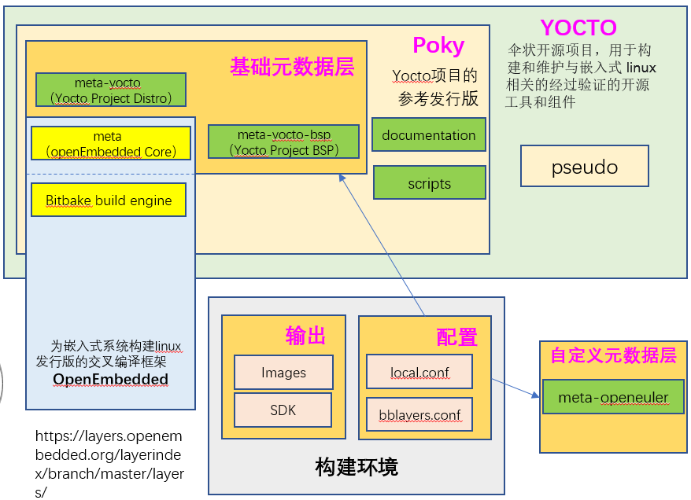

## 2. OpenEmbedded 构建系统
  
   一般来说，构建过程的工作流程包含以下几个功能区域：

   - **用户配置**：可用于控制构建过程的元数据。
   - **元数据层**：提供软件、机器和发行版元数据的各种层。
   - **源文件**：上游版本、本地项目和 SCM。
   - **构建系统**：BitBake控制下的进程 
   - **软件包源**：包含输出软件包（RPM、DEB 或 IPK）的目录，这些软件包随后用于构建由构建系统生成的镜像或软件开发工具包 (SDK)。
   - **图像**：工作流程生成的图像。
   - **应用程序开发 SDK**：与镜像一起生成或单独使用 BitBake 生成的交叉开发工具。
   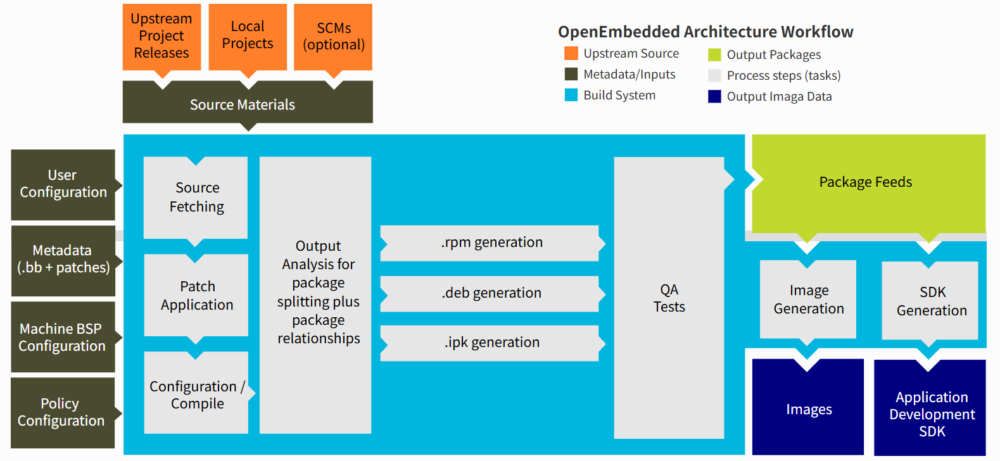

### 2.1 用户配置
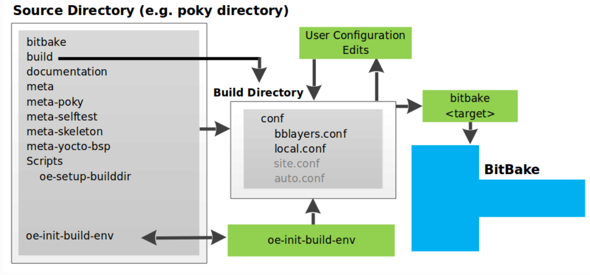

配置环境：

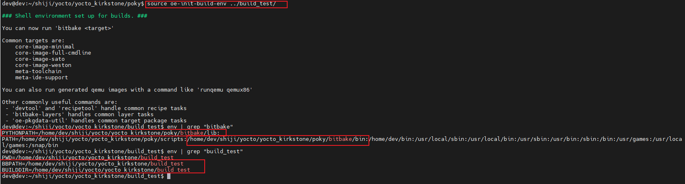
 
**local.conf**文件提供了定义构建环境的许多基本变量。以下列出其中一些：

- **目标机器选择**：由MACHINE变量控制 。

- **下载目录**：由DL_DIR变量控制 。

- 共享状态目录：由SSTATE_DIR变量控制 。

- **构建输出**：由TMPDIR变量控制 。

- **分发策略**：由DISTRO变量控制 。

- 包装格式：由PACKAGE_CLASSES变量控制 。

- SDK 目标架构：由SDKMACHINE变量控制 。

- 额外图像包：由EXTRA_IMAGE_FEATURES变量控制 。

### 2.2 构建层级

构建层级分为软件、机器和发行层。

- **元数据（.bb 文件 + 补丁）**：包含用户提供的配方文件、补丁和追加文件的软件层。OpenEmbedded Layer Index 中的meta-qt5 层就是一个很好的软件层示例。该层适用于流行的跨平台应用程序开发框架Qt的 5.0 版本，该框架支持桌面、嵌入式和移动应用开发。

- **机器 BSP 配置**：板级支持包 (BSP) 层提供特定于机器的配置信息。此类信息特定于特定的目标架构。参考 发行版 (Poky)中的**meta-yocto-bsp**层就是 一个典型的 BSP 层示例 。

- **发行配置**：发行层为特定分发版本构建的镜像或 SDK 提供顶级或通用策略。例如，在 Poky 参考分发版本中，分发层是**meta-poky**层。分发层中包含一个conf/distro目录，其中包含分发配置文件（例如 poky.conf ，其中包含 Poky 分发版本的许多发行配置）。

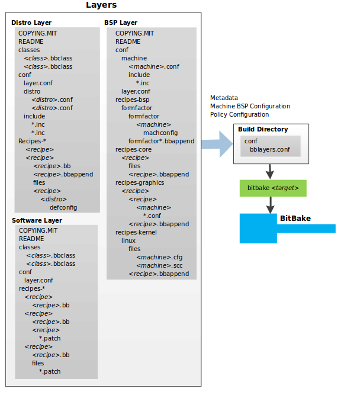

- BitBake 使用**build_xxx/conf/bblayers.conf**用户配置中的该文件来查找在构建过程中应该使用的层。
- BitBake 根据**xxxLayer/conf/layer.conf** 去查找Layer下的.bb文件

   local.conf 示例：

   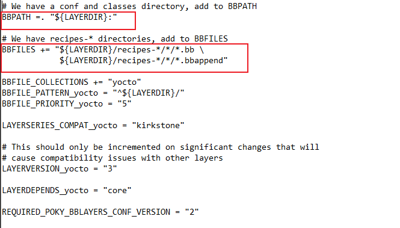

#### 2.2.1 发行层
分发层为您的分发提供策略配置

在分发层中找到哪些内容：

- 类：类文件（.bbclass）包含可在发行版中各个配方之间共享的通用功能。当您的配方继承一个类时，它们将采用该类的设置和功能。
- conf：此区域包含层（conf/layer.conf）、**发行版（conf/distro/distro.conf）**和任何发行版范围的包含文件的配置文件。
- **recipes-XXX**：影响整个发行版通用功能的配方和追加文件。此区域可能包含用于添加特定于发行版的配置、初始化脚本、自定义镜像配方等的配方和追加文件。
  
#### 2.2.2 BSP 层
BSP 层提供针对特定硬件的机器配置。

BSP 层的配置目录包含机器的配置文件（conf/machine/machine.conf）以及当然还有层的配置文件（conf/layer.conf）。

#### 2.2.3 软件层

软件层提供构建过程中使用的其他软件包的元数据。该层不包含特定于发行版或机器的元数据，这些元数据位于它们各自的层中。

这一层包含项目所需的任何配方、追加文件和补丁。

### 2.3 源文件
源文件分为：上游项目文件、本地项目和源代码管理

源文件视图：

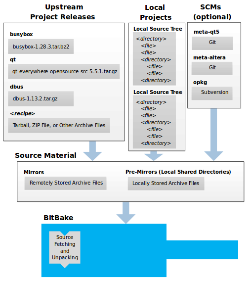

- **上游项目发布**：上游项目版本以归档文件（例如 tarball 或 zip 文件）的形式存在于任何地方
- **本地项目**： 本地项目是指用户提供的自定义软件片段
- **源代码控制管理器**：构建系统还可以通过 各种源代码控制管理器（例如 Git 或 Subversion）提供的 获取器来获取源文件
- **源镜像**： 镜像分为两种：预镜像和常规镜像。PREMIRRORS 和 MIRRORS变量分别指向这两种镜像。BitBake 会先检查预镜像，然后再向上游查找源文件。
  - 预镜像通常指向您组织本地的共享目录。
  - 常规镜像站点可以是互联网上的任何站点，当主站点由于某种原因无法正常运行时，这些站点可用作源代码的备用位置。
   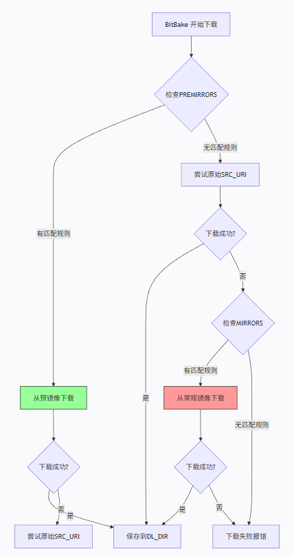

变量：
- **SRC_URI**： 变量指向源文件，而无需考虑其实际位置。每个配方都必须有一个指向源文件的SRC_URI变量。
- **DL_DIR（下载目录）**：首次构建时，系统会从不同的上游项目下载许多不同的源代码压缩包。所有压缩包都存储在由DL_DIR定义的目录中，构建系统会首先在该目录中查找源代码压缩包。
   
   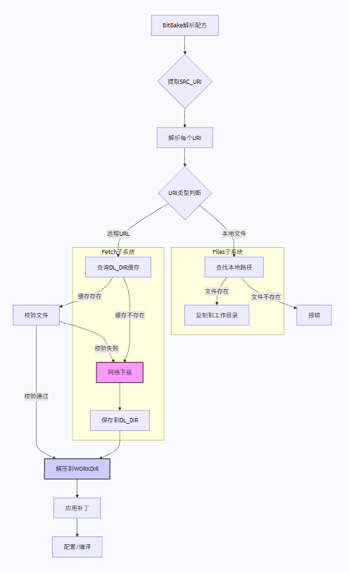
### 2.4 Package Feeds
当 OpenEmbedded 构建系统生成镜像或 SDK 时，它会从 构建目录中的软件包源区域获取软件包。

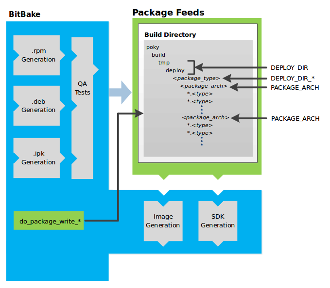

构建系统用于临时存储软件包的目录由多个变量以及所使用的特定软件包管理器共同决定。
- **DEPLOY_DIR**：定义在 tmp/deploy构建目录中。
- **DEPLOY_DIR_XXX**: 根据所使用的包管理器，包类型子文件夹也会有所不同。如果打包的是 RPM、IPK 或 DEB 格式，并且创建了 tarball 文件，则 分别使用DEPLOY_DIR_RPM、 DEPLOY_DIR_IPK、 DEPLOY_DIR_DEB或 DEPLOY_DIR_TAR变量。
- **PACKAGE_ARCH**：定义特定于架构的子文件夹。例如，软件包可以适用于 i586 或 qemux86 架构。

### 2.5 BitBake 工具
#### 2.5.1 基本变量

此章节仅介绍一些最基本的变量，开发者如果有不理解的变量，可以在 poky/documentation/ref-manual/variables.rst 文档查找介绍。此外，这些变量通常在bitbake.conf文件存在定义。

- **MACHINE**： 指定使用的硬件配置文件，通常在local.conf文件定义；
- **DISTRO**： 指定使用的发行版配置文件，通常在local.conf文件定义；
- **PN**： 软件包名，一般是根据文件名自动生成；除了一些交叉编译的包，如gcc-cross会在bb中重新定义；
- **PV**： 软件包版本；
- **PR**： 食谱的修订，默认为r0；当包管理器在已构建的镜像上动态安装包时，PR很重要；
- **BPN**： 软件包名，去除指定的前后缀(如-native、-cross等)；
- **BP**： ${BPN}-${PV};
- **SRC_URI**： 源码路径，可以为上游或者本地文件路径，上游源码需要使用校验值；
- **LICENSE： 配方的源许可证列表，必须设置；如果设置为”CLOSED”则关闭**；
- LIC_FILES_CHKSUM： 配方源代码中许可证文本的校验和，与LICENSE变量配合使用；
- **PACKAGE_ARCH**： 生成包的体系结构；
- TARGET_VENDOR： 指定目标供应商的名称，openEuler设置为”-openeuler”；
- **TARGET_OS**： 指定目标的操作系统；
- MULTIMACH_TARGET_SYS： 生成包的目标系统类型的唯一标识，默认为${PACKAGE_ARCH}${TARGET_VENDOR}-${TARGET_OS}；
- WORKDIR： 构建配方的工作目录的路径名，指向${TMPDIR}/work/${MULTIMACH_TARGET_SYS}/${PN}/${EXTENDPE}${PV}-${PR}，EXTENDPE变量通常不被设置；
- **S： 构建过程中源代码位置，默认为${WORKDIR}/${BPN}-${PV}**；
- **B： 构建过程中生成对象所在的目录，默认与S相同；一些类会将B设置为${WORKDIR}/build**；
- **D： 相当于 make install 后的目标目录，指向${WORKDIR}/image**；
- PACKAGES： 表示配方创建的包列表；
- FILES_xxx： 放置在包中的文件和目录列表；
- **PKGD： 要打包的文件的目录，指向${WORKDIR}/package**；
- PKGDEST： 将文件拆分为单独的包后，指向要打包的文件的父目录，该目录是PACKAGES中指定的每个包的目录，指向${WORKDIR}/packages-split；
- DEPENDS： 列出配方的构建时依赖关系，配方在构建时需要其它配方的内容（例如头文件和共享库）；
- RDEPENDS： 列出程序包的运行时依赖项，这些依赖项是必须安装的其他程序包，以便程序包正常运行；
- RECIPE_SYSROOT： 指向${WORKDIR}/recipe-sysroot；
- RECIPE_SYSROOT_NATIVE： 指向${WORKDIR}/recipe-sysroot-native；
- SYSROOT_DESTDIR： 指向${WORKDIR}/sysroot-destdir；
- SYSROOT_DIRS： 暂存到${SYSROOT_DESTDIR}的目录；
- STAGING_DIR_HOST： 组件运行所在的系统上的sysroot路径，默认为${RECIPE_SYSROOT}。
- STAGING_DIR_NATIVE： 构建主机上运行的组件使用的sysroot的路径，默认为${RECIPE_SYSROOT_NATIVE}；
- STAGING_DIR_TARGET： 当构建在系统上执行的组件并为另一台机器生成代码（例如cross-canadian配方）时使用的sysroot路径；
- STAGING_KERNEL_DIR： 包含构建树外模块所需的内核头文件的目录（内核源码目录）；
- STAGING_KERNEL_BUILDDIR： 指向包含内核构建工件的目录。需要访问内核构建工件的配方构建软件可以在内核构建后在STAGING_KERNEL_BUILDDIR变量指定的目录中查找这些工件；
- **PACKAGE_CLASSES： 指定构建系统在打包数据时使用的包管理器（例如RPM、DEB或IPK），在local.conf文件设置**；
- IMAGE_ROOTFS： 指定根文件系统在构建过程中的位置（ do_rootfs 任务期间）。此变量不可配置，不要更改它；
- IMAGE_FEATURES： 指定要包含在镜像中的主要功能列表，这些功能大多数都映射到其他安装包；
- EXTRA_IMAGE_FEATURES： IMAGE_FEATURES的一部分；
- IMAGE_INSTALL： 指定要安装到镜像中的程序包；
- PACKAGE_EXCLUDE： ：指定不应安装到image中的包；
- PACKAGE_INSTALL： 要安装到镜像中的程序包的列表，不要更改它，通常使用IMAGE_INSTALL变量间接进行修改；
- DEPLOY_DIR： 指向构建系统用于放置镜像、包、SDK和其他输出文件的常规区域，这些文件已准备好在构建系统之外使用。默认情况下，此目录位于指向${TMPDIR}/deploy。
- DEPLOY_DIR_IMAGE： 指向构建系统用来放置准备部署到目标计算机上的镜像和其他相关输出文件的区域。该目录是特定于机器的默认情况下，此目录指向${DEPLOY_DIR}/images/${MACHINE}/；
- DEPLOYDIR： 当继承deploy类时，DEPLOYDIR指向已部署文件的临时工作区，默认指向${WORKDIR}/deploy-${PN}，此目录内容会被拷贝到${DEPLOY_DIR_IMAGE}；
- CC： 用于运行C编译器的最小命令和参数；
- CFLAGS： 指定要传递给C编译器的标志；
- CXXFLAGS： 指定要传递给C++编译器的标志；
- CPPFLAGS： 指定要传递给C预处理器（即同时传递给C编译器和C++编译器）的标志；
- LDFLAGS： 指定要传递给链接器的标志；
- OVERRIDES： 以冒号分隔的当前应用的覆盖列表。覆盖是一种BitBake机制，允许在解析结束时选择性地覆盖变量；
- COMPATIBLE_MACHINE： 一种正则表达式，解析为一个或多个与配方兼容的目标机器。可以使用该变量来停止为配方不兼容的机器构建配方，停止这些构建对于内核特别有用。该变量还有助于提高解析速度，因为构建系统会跳过与当前机器不兼容的解析配方。

#### 2.5.2 基本任务
配方（.bb文件）使用任务来完成软件的配置、编译和打包等。本节提供了在OpenEmbedded（Yocto）构建系统中定义的部分任务的作用。

Yocto支持的主要任务如下：

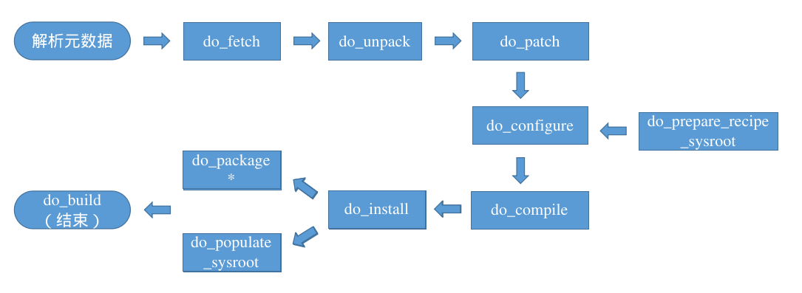

每个包实际的任务执行顺序可以在工作目录查看，具体是 **$WORKDIR/temp/log.task_order** 文件。

- **do_build**: 配方的默认任务，依赖于构建一个配方的所有其他正常构建任务。因为Yocto默认在 meta/classes/base.bbclass 中设置了 **do_build[noexec] = "1"** ，因此此任务并不会真的执行，只是一个虚拟任务，用于串连起各个模块的任务流。构建时，temp目录下不会存在其执行执行脚本及执行日志文件。
- **do_fetch/do_unpack**:
  - **do_fetch**: 获取源文件
  - **do_unpack**: 将源文件解压到工作目录（${WORKDIR}）下
   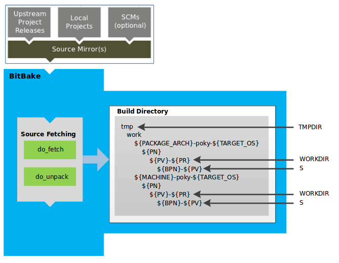
   示例：
   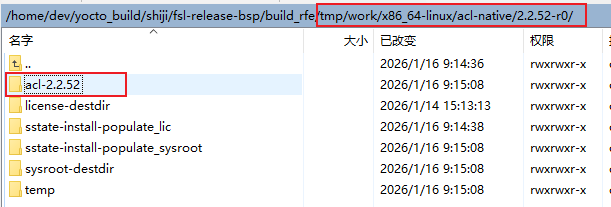
- **do_patch**: 在获取、解压源码后打入补丁到源码目录（${S}），根据SRC_URI变量中补丁文件写入的顺序打入补丁
- **do_prepare_recipe_sysroot**: 为当前配方（recipe）准备构建环境所需的 sysroot，主要包含构建时依赖（DEPENDS 和 BUILDDEPENDS）的文件
  - 从构建时依赖（如交叉编译工具链、库的头文件和 .so 文件）中提取必要文件到 recipe-sysroot 目录
   - 创建两个主要目录：
      - recipe-sysroot：包含目标架构的依赖库和头文件（用于链接）
      - recipe-sysroot-native：包含本机架构的工具（用于构建过程）
   - 处理所有 DEPENDS 中指定的依赖项，将它们的内容复制到当前配方的 sysroot 中
- **do_configure**: 通过启用和禁用正在构建软件的任何构建时和配置选项来配置源码
- **do_compile**: 编译源代码
- **do_install**: 复制要打包文件到保留区（${D}）
   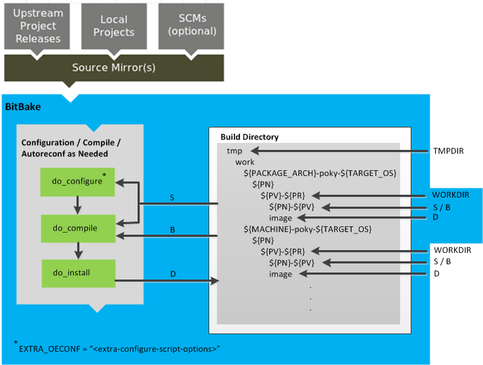
- **do_populate_sysroot**: 将当前配方的构建输出安装到全局 sysroot 中，供其他配方作为依赖使用
   - 将当前配方的以下内容复制到全局 sysroot：
      - 头文件（include 目录）
      - 库文件（lib 目录）
      - 编译生成的 .pc 文件（pkg-config）
      - 其他其他配方可能需要的内容
   - 创建符号链接和必要的元数据
   - 为依赖此配方的其他配方提供构建时所需的文件
- **do_package:**： 根据PACKAGES和FILES_xxx变量，分析在${D}目录中找到的文件，并根据可用的包和文件将它们拆分为子集。
- **do_packagedata**: 将 do_package 任务生成的包元数据保存在PKGDATA_DIR目录中，以使其全局可用，以便构建系统可以生成最终包。

分析和包拆分过程的工作、阶段和中间结果使用以下几个方面：

   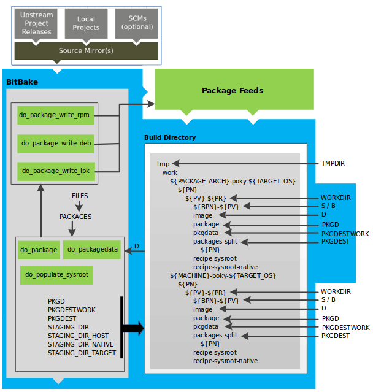

- **do_package_write_XXX:**
  - do_package_write_rpm：创建 RPM 包（即*.rpm文件）
  - do_package_write_deb：创建 Debian 包（即*.deb文件）
  - do_package_write_ipk：创建 IPK 包（即*.ipk文件）
  - do_package_write_tar：创建 tar.gz 包
- **do_package_qa**： 对打包文件运行QA检查。在构建配方时，OpenEmbedded构建系统会对输出执行各种QA检查，以确保检测和报告常见问题
- **do_deploy**： 将要部署的输出文件写入${DEPLOY_DIR_IMAGE}
- **do_rootfs**： 为镜像创建根文件系统（文件和目录结构）
- **do_image**：启动镜像生成过程，此任务通过 IMAGE_PREPROCESS_COMMAND 对image进行预处理，并通过动态生成的 do_image_xxx （镜像格式决定）任务构建图像
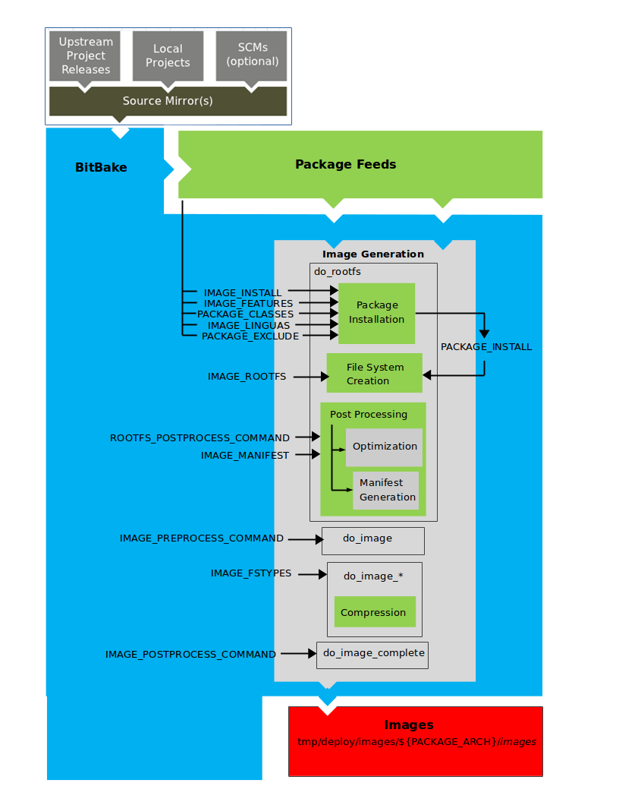
- **do_image_complete**：完成图像生成过程，此任务通过POSTPROCESS_COMMAND对图像执行后处理。

#### 2.5.3 BitBake 任务映射：
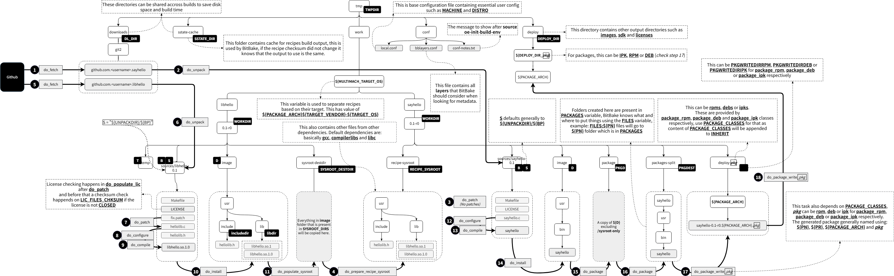

